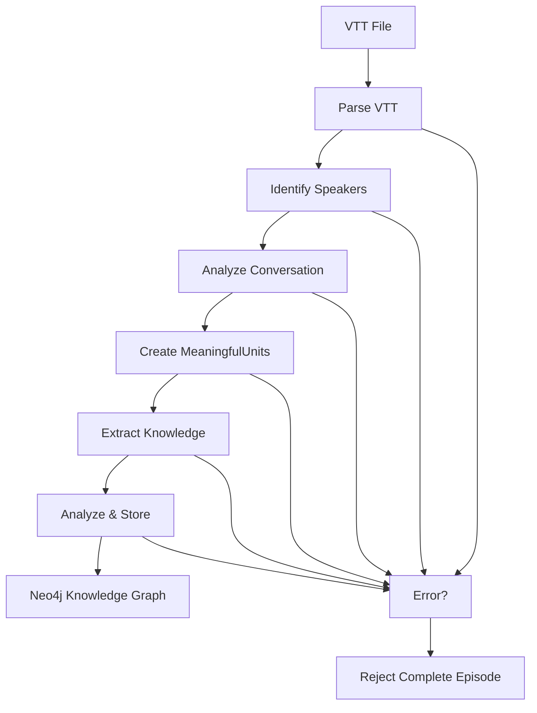

# Unified Pipeline Usage Guide

This guide documents the **single approach** for processing VTT podcast transcripts into knowledge graphs using the unified knowledge pipeline.

## Overview

The unified pipeline processes VTT files through these phases:
1. **VTT Parsing** - Extract transcript segments
2. **Speaker Identification** - Map generic speakers to real names  
3. **Conversation Analysis** - Identify themes and structure
4. **Semantic Grouping** - Create MeaningfulUnits from segments
5. **Knowledge Extraction** - Extract entities, quotes, insights, relationships
6. **Analysis** - Run gap detection, diversity metrics, missing links
7. **Storage** - Save to Neo4j with complete data integrity

## Pipeline Flow Diagram



## Configuration Requirements

### Required Environment Variables

```bash
# Neo4j Database (Required)
NEO4J_URI=bolt://localhost:7687
NEO4J_USERNAME=neo4j
NEO4J_PASSWORD=your_password
NEO4J_DATABASE=neo4j

# LLM Service (At least one required)
GOOGLE_API_KEY=your_google_api_key
OPENAI_API_KEY=your_openai_api_key

# Optional
LOG_LEVEL=INFO
```

### Configuration Object

```python
from src.core.config import PipelineConfig

# Simple initialization with defaults
config = PipelineConfig()

# Override paths if needed
config = PipelineConfig(
    output_dir=Path("./my_output"),
    checkpoint_dir=Path("./my_checkpoints")
)
```

## Basic Usage

### Initialize Pipeline

```python
from src.pipeline.unified_pipeline import UnifiedKnowledgePipeline
from src.storage.graph_storage import GraphStorageService
from src.services.llm import LLMService
from pathlib import Path

# Initialize services
graph_storage = GraphStorageService(
    uri="bolt://localhost:7687",
    username="neo4j", 
    password="your_password"
)
llm_service = LLMService()

# Create pipeline
pipeline = UnifiedKnowledgePipeline(graph_storage, llm_service)
```

### Process VTT File

```python
import asyncio

async def process_episode():
    # Episode metadata
    episode_metadata = {
        "episode_id": "unique_episode_id",
        "title": "Episode Title",
        "description": "Episode description",
        "youtube_url": "https://youtube.com/watch?v=VIDEO_ID"
    }
    
    # Process VTT file
    result = await pipeline.process_vtt_file(
        vtt_path=Path("transcript.vtt"),
        episode_metadata=episode_metadata
    )
    
    return result

# Run processing
result = asyncio.run(process_episode())
print(f"Processed {result['meaningful_units_created']} meaningful units")
```

## Knowledge Types Extracted

### Entities
- **People**: Speakers, mentioned individuals
- **Organizations**: Companies, institutions  
- **Technologies**: Software, frameworks, tools
- **Concepts**: Ideas, methodologies, theories
- **Custom Types**: Any entity type the LLM discovers

### Relationships
- **MENTIONS**: Entity mentioned in context
- **DISCUSSES**: Deep discussion of topic
- **QUOTES**: Direct quotations with speakers
- **Custom Types**: Dynamic relationship discovery

### Quotes
- **Memorable**: Impactful statements
- **Technical**: Code or technical explanations
- **Humorous**: Jokes and light moments
- **Controversial**: Debatable statements

### Insights
- **Technical**: Implementation details
- **Strategic**: Business insights
- **Personal**: Individual experiences
- **Predictive**: Future trends

## Schema-less Discovery Examples

The pipeline automatically discovers new entity and relationship types:

### Example: Quantum Computing Content

**Input VTT**: Discussion about quantum computing

**Discovered Entities**:
- `Quantum_Information_Theorist`
- `Superconducting_Quantum_Computer`
- `Gottesman_Kitaev_Preskill_Encoding`

**Discovered Relationships**:
- `THEORIZED`
- `EXPERIMENTALLY_VERIFIED`
- `ENTANGLED_WITH`

### Example: Startup Discussion

**Input VTT**: Entrepreneurship conversation

**Discovered Entities**:
- `Venture_Capital_Firm`
- `Product_Market_Fit_Strategy`
- `YCombinator_Alumni`

**Discovered Relationships**:
- `FUNDED_BY`
- `ACHIEVED_THROUGH`
- `GRADUATED_FROM`

## YouTube URL Generation

The pipeline automatically generates YouTube URLs with proper timestamps:

### Timestamp Adjustment
- **Original timestamp**: From VTT segment start time
- **Adjusted timestamp**: Minus 2 seconds for context
- **Minimum**: 0 seconds (no negative timestamps)

### URL Format
```
https://youtube.com/watch?v=VIDEO_ID&t=ADJUSTEDs
```

### Examples
```python
# VTT segment: 00:02:30.000 --> 00:02:35.000
# Adjusted time: 148 seconds (150 - 2)
# URL: https://youtube.com/watch?v=abc123&t=148s

# VTT segment: 00:00:01.500 --> 00:00:05.000  
# Adjusted time: 0 seconds (1.5 - 2, minimum 0)
# URL: https://youtube.com/watch?v=abc123&t=0s
```

## Error Handling Behavior

### Complete Episode Rejection

The pipeline follows **all-or-nothing** processing:

- **On Success**: All data stored in Neo4j
- **On Error**: Complete episode rejection, no partial data

### Error Types

1. **SpeakerIdentificationError**: Cannot identify real speaker names
2. **ConversationAnalysisError**: Cannot analyze conversation structure  
3. **ExtractionError**: Knowledge extraction fails
4. **VTTProcessingError**: Cannot parse VTT file

### Error Response

```python
{
    "status": "failed",
    "error_type": "SpeakerIdentificationError", 
    "message": "Could not identify speakers in transcript",
    "episode_id": "episode_123"
}
```

## Data Storage Structure

### Neo4j Node Types

- **Episode**: Episode metadata and identifiers
- **MeaningfulUnit**: Semantic chunks of conversation
- **Entity**: Extracted entities with types and properties
- **Quote**: Memorable statements with speakers
- **Insight**: Extracted insights and analysis
- **Sentiment**: Emotion and attitude analysis

### Relationship Types

- **PART_OF**: MeaningfulUnit belongs to Episode
- **MENTIONS**: Entity mentioned in MeaningfulUnit
- **SPOKEN_BY**: Quote attributed to speaker
- **DISCOVERED_IN**: Insight found in MeaningfulUnit
- **Custom**: Dynamic relationship types

## Troubleshooting Guide

### Common Issues

#### 1. Speaker Identification Fails

**Symptom**: `SpeakerIdentificationError` raised

**Causes**:
- VTT has no speaker tags (`<v Speaker>`)
- Generic speaker labels only
- Inconsistent speaker naming

**Solution**:
```vtt
WEBVTT

00:00:00.000 --> 00:00:05.000
<v John Smith>Real speaker names required

00:00:05.000 --> 00:00:10.000  
<v Jane Doe>Not just "Speaker 1" or "Host"
```

#### 2. Knowledge Extraction Fails

**Symptom**: `ExtractionError` during processing

**Causes**:
- Malformed text content
- Empty meaningful units
- LLM service unavailable

**Solution**:
- Verify text content quality
- Check API keys and LLM service
- Ensure meaningful conversation content

#### 3. Neo4j Connection Issues

**Symptom**: Connection errors during storage

**Causes**:
- Neo4j not running
- Incorrect credentials
- Network connectivity

**Solution**:
```bash
# Check Neo4j status
docker ps | grep neo4j

# Verify credentials
NEO4J_URI=bolt://localhost:7687
NEO4J_USERNAME=neo4j
NEO4J_PASSWORD=correct_password
```

#### 4. Empty Results

**Symptom**: Processing succeeds but no entities extracted

**Causes**:
- Content too brief
- No meaningful conversation
- Technical content only

**Solution**:
- Ensure sufficient conversation length (>5 minutes)
- Include substantive discussion topics
- Mix technical and conceptual content

### Performance Guidelines

#### Optimal VTT Content

- **Duration**: 5-60 minutes recommended
- **Speakers**: 2-4 participants ideal
- **Content**: Mix of topics, not pure technical discussion
- **Quality**: Clear speaker identification throughout

#### Resource Requirements

- **Memory**: 4GB+ recommended for large episodes
- **CPU**: Multi-core for parallel processing
- **Storage**: 100MB+ free space for checkpoints
- **Network**: Stable connection for LLM APIs

## Advanced Usage

### Batch Processing

```python
async def process_multiple_episodes():
    episodes = [
        {"vtt": "episode1.vtt", "metadata": {...}},
        {"vtt": "episode2.vtt", "metadata": {...}},
    ]
    
    results = []
    for episode in episodes:
        try:
            result = await pipeline.process_vtt_file(
                Path(episode["vtt"]), 
                episode["metadata"]
            )
            results.append({"status": "success", "result": result})
        except Exception as e:
            results.append({"status": "failed", "error": str(e)})
    
    return results
```

### Custom Analysis

```python
# Access analysis results after processing
result = await pipeline.process_vtt_file(vtt_path, metadata)

gap_analysis = result["analysis"]["gap_detection"]
diversity_metrics = result["analysis"]["diversity_metrics"] 
missing_links = result["analysis"]["missing_links"]
```

## Best Practices

### 1. VTT File Preparation
- Ensure consistent speaker naming throughout
- Use real names, not generic labels
- Include timestamps for all segments
- Verify text quality and completeness

### 2. Episode Metadata
- Provide unique episode IDs
- Include accurate YouTube URLs
- Add descriptive titles and summaries
- Use consistent naming conventions

### 3. Error Management
- Always handle exceptions gracefully
- Log all processing attempts
- Monitor for partial failures
- Implement retry logic for transient errors

### 4. Performance Optimization
- Process episodes sequentially to avoid rate limits
- Use appropriate checkpoint intervals
- Monitor memory usage for large episodes
- Clean up temporary files after processing

## API Reference

### UnifiedKnowledgePipeline.process_vtt_file()

**Syntax**: `process_vtt_file(vtt_path: Path, episode_metadata: Dict) -> Dict`

**Parameters**:
- `vtt_path`: Path to VTT transcript file
- `episode_metadata`: Episode information including ID, title, YouTube URL

**Returns**: Processing results with counts and analysis data

**Raises**:
- `VTTProcessingError`: VTT file issues
- `SpeakerIdentificationError`: Speaker identification fails
- `ConversationAnalysisError`: Conversation analysis fails
- `ExtractionError`: Knowledge extraction fails

### Example Response

```python
{
    "status": "completed",
    "processing_time": 45.2,
    "meaningful_units_created": 12,
    "entities_extracted": 34,
    "quotes_extracted": 18,
    "insights_extracted": 8,
    "relationships_created": 67,
    "youtube_urls_generated": 12,
    "analysis": {
        "gap_detection": {...},
        "diversity_metrics": {...},
        "missing_links": {...}
    }
}
```

---

**Remember**: The unified pipeline uses a **single approach only**. There are no alternative configurations, feature toggles, or processing modes. All episodes are processed with the complete feature set for maximum knowledge extraction.